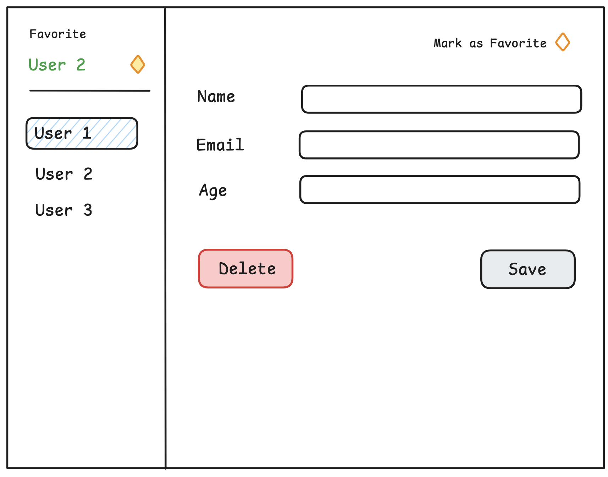

# Exploring React v19 Features

## What is it?

React team has just released a stable version of React v19. So in this project, I want to explore more about several new features that are introduced in the v19 release. Some features that I am more interested with are:

- Optimistic update with `useOptimistic`
- Handling form submission with `useActionState`
- The new `use` hook

Alright, let's do it

## Project Plan

### Context

To understand more, I want to build a simple contact management project. Here's breakdown of the core features:

- Add new contact
- Delete contact
- Show list of contacts
- Show contact detail
- Optimistically update contact detail & reverse when there is an error
- Mark contact as favorite

### Setup

To simplify project setup, I will just use these things:

- mock API to handle everything
- store data in `localstorage`

### Design

Just some basic wireframe here. Basically we got contact list on sidebar, and detail on the right side.
 
 

